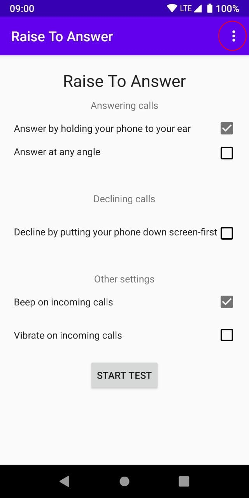
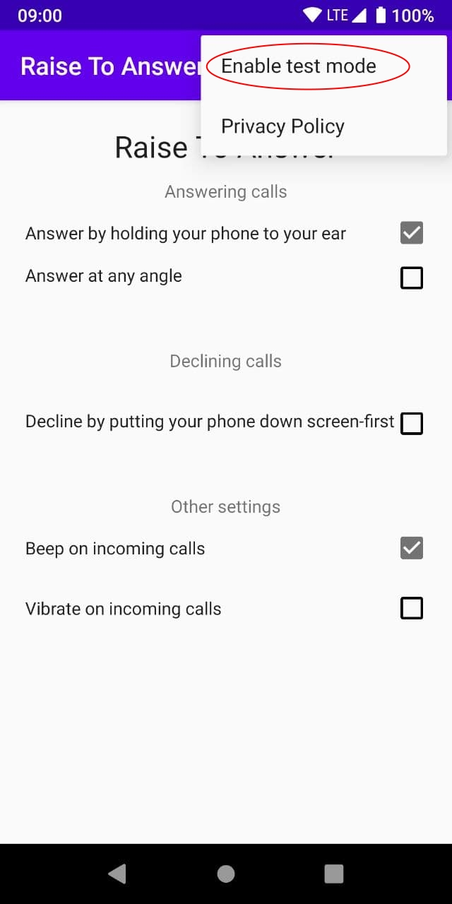
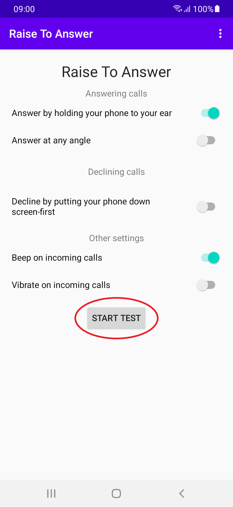
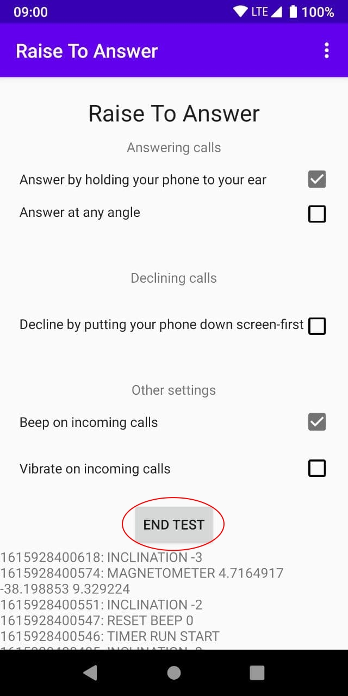
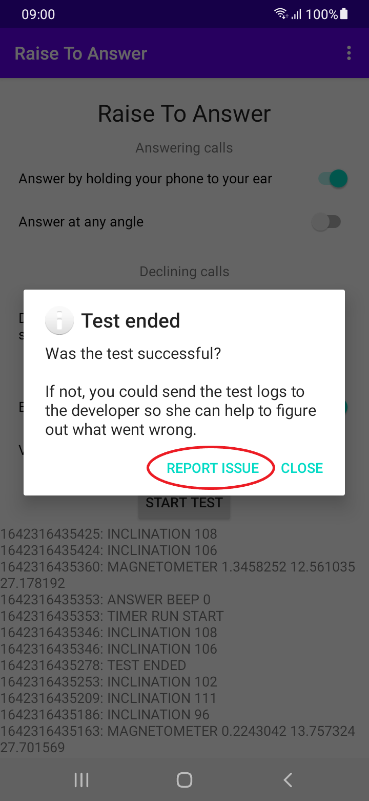

# Raise To Answer (Android)


*Logo by [Rose (TangentFoxy)](http://github.com/TangentFoxy)*

Simply hold your phone to your ear to answer an incoming call. When the app detects the phone is near your ear during an incoming call, it will beep 5 times and then answer the call.

No ads, no unnecessary permissions and no unnecessary battery drain. Easy to enable and disable. Doesn't replace your incoming call screen, so you don't need to learn anything new.

[](https://apt.izzysoft.de/fdroid/index/apk/me.hackerchick.raisetoanswer)
[](https://play.google.com/store/apps/details?id=me.hackerchick.raisetoanswer)
    
<a href="https://hosted.weblate.org/engage/raisetoanswer/">

</a>

## How to build

Building can either be done through Android Studio (not reproducible!) or the build.sh script in this repository (reproducible with OpenJDK 17). This script can also sign the build.

Build without signing:
```
./build.sh
```

Build with signing:
```
KEYSTORE=/path/to/keystore KEYSTORE_ALIAS=raisetoanswer ./build.sh
```

## Debugging
Sensors are complicated. If the app isn't working as you expect it to, please help me by giving some debug logging.

First, tap the menu in the top right.  


Then, choose "Enable test mode".  


Put the phone down in the resting position, and tap "Start Test". Then, answer or decline the phone as seems natural to you.  


After having tried to answer or decline, press "End Test".  


If the issue appeared, press "Report Issue". This will open your email application and allow you to send debug logging to me.  


Please add any information you can think of to the email but don't remove any of the existing text.

## License

MIT
